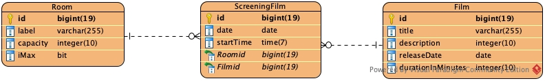

# Nome del Progetto

Questo progetto è un'applicazione web sviluppata con Spring Boot e Java.
Utilizza un database MySQL, che viene gestito tramite Docker.
L'applicazione fornisce una serie di endpoint RESTful per la gestione dei film del progetto CineMille che possono essere
testati utilizzando il file `http-requests.http`.

## Requisiti

- Java
- Maven
- Docker
- Spring Boot

## Versioni

- Spring Boot: 3.2
- Java: 21
- MySQL: 8.0

## Struttura del Progetto

Il database MySQL viene gestito tramite Docker. Puoi avviare il database utilizzando il comando `docker-compose up -d`,
che avvierà un container Docker con un'istanza di MySQL con le credenziali `root` e `verysecret`.

### Class Diagram

Per il progetto è stato creato un diagramma delle classi che mostra le classi e le relazioni tra di esse.
Il diagramma è stato creato utilizzando [visual paradigm](https://www.visual-paradigm.com).

### Diagramma ER

Per il database in uso è stato creato un diagramma ER che mostra le entità e le relazioni tra di esse.
Anche per questo diagramma è stato creato utilizzando [visual paradigm](https://www.visual-paradigm.com).

### Dati Fittizi

All'avvio dell'applicazione, vengono inseriti dei dati fittizi nel database. Questi dati sono definiti nel
file `src/main/resources/data.sql`.

#### Swagger

All'indirizzo http://localhost:8080/api/swagger-ui/index.html è disponibile la documentazione dei servizi REST
esposti.

### Test

Per testare gli endpoint dell'applicazione è presente un file `http-requests.http`. Questo file contiene una serie di
richieste HTTP che possono essere utilizzate per interagire con l'applicazione.

## Avvio dell'applicazione

Per avviare l'applicazione, esegui il comando `./mvnw spring-boot:run`.