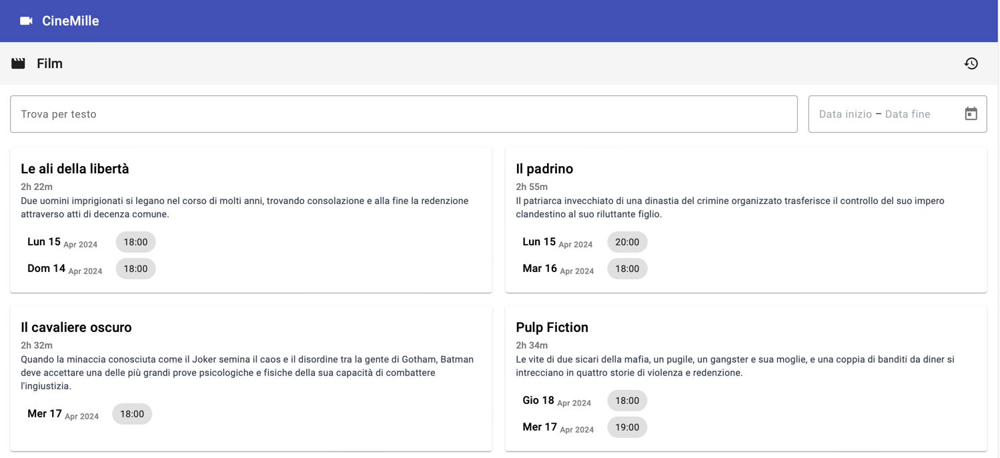

# Frontend

Questo progetto è stato generato con [Angular CLI](https://github.com/angular/angular-cli) e utilizza Angular versione 17.3.3 e [Angular Material](https://material.angular.io) per la UI.

Serve come frontend per il progetto CineMille in cui vengono visualizzati i film attualmente in proiezione e lo storico di questi.

## Esecuzione

Installare le dipendenze con `npm install`. Eseguire il comando `ng serve` per un server di sviluppo. Navigare su [http://localhost:4200/]().
La pagina sarà come la seguente:

### Formattazione e indentazione del codice

Questo progetto utilizza **Prettier** ed **ESLint** per la formattazione e l'indentazione del codice. Assicurati di avere queste estensioni installate nel tuo editor di codice e abilitate per questo progetto.
